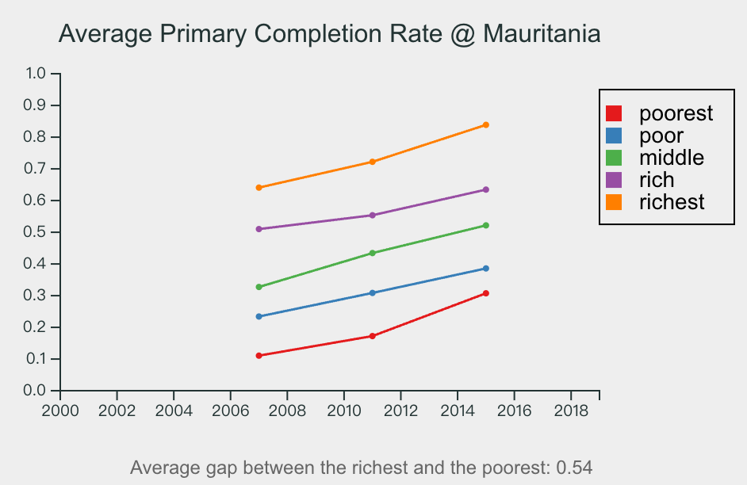

> **Note**
> The code for "Milestone 4: Static Vis Implementation" was saved in the [m4 branch](https://github.com/idiotWu/CS541-DDPoetry/tree/m4).

# Data-Driven Poetry

This repo contains code for the Data-Driven Poetry in [CS 541 - Information Visualization](https://emilywall.github.io/vis/index.html) class at Emory University.

Please check [https://idiotwu.github.io/CS541-DDPoetry/](https://idiotwu.github.io/CS541-DDPoetry/) for the production build.

## Modifications Since M3

I realized that each category is calculated independently and is not a part of the whole, so stacked bar chart may not be suitable in my case. Therefore, I changed the design to an interactive globe where you can hover over a certain country to see details. The color of each country is determined by the gap between the richest and the poorest, e.g., for data

| Wealth Level | Primary Completion Rate |
| ------------ | ----------------------- |
| Poorest      | 0.1                     |
| Poor         | 0.3                     |
| Middle       | 0.7                     |
| Rich         | 0.9                     |
| Richest      | 1.0                     |

The gap is `Richest - Poorest = 0.9`. Greater gaps will be rendered in red colors and smaller gaps will be in greens.

Currently, I only visualized one indicator "primary completion rate" in this milestone. I will create a selection menu to switch between different indicators in the next milestone.

## Scrollytelling Strategy

The scrolling of the poetry is based on the hovered country:

1. Display the first verse "The Distorted Reality" by default.
2. If the gap value of the hovered country is in the upper 30% (i.e., the country is rendered in reddish colors):
   1. If the value of the poorest families is lower than 0.3, scroll to the "The Road of Disparity" verse to show the struggle of the poor children.
   2. Otherwise, scroll to the "The Palace of Privilege" verse to depict the smooth life of the rich.
3. Else if the gap value of the hovered country is between the upper 70% and the upper 30% (i.e., the country is rendered in yellow colors), scroll to the "The Call for Change" verse to call for educational revolution.
4. Otherwise, the gap will be within the lower 30% (i.e., the country is rendered in green colors), which means there is no significant difference between the richest and the poorest. Therefore, we will scroll to the "The Dream of Educational Equality" verse.

## About Line Plots

I also tried to add line plots to the visualization, but it turned out that the line plots might not be suitable for this dataset since it contained plenty of missing values:



## Local Development Setup

1. Install node.js (18 or 20): https://nodejs.org/en/download
2. Clone this repository and `cd` to the root
3. Install dependencies using
   ```bash
   npm install
   ```
4. Start a local server using
   ```bash
   npm run dev
   ```
5. Visit http://localhost:5173 for development build.
